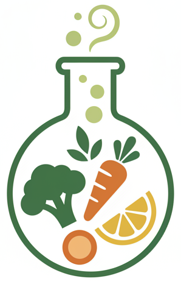

<div align="center">
  
</div>

# 🍳 Recipe Lab

AI-powered recipe generator based on your available ingredients. Multilingual, modern, and installable as a PWA.

👉 [Live demo](https://recipelab-859ee.web.app/)

## 🚀 Tech Stack
- **Frontend:** Vue 3, Vite, TypeScript, Vue Router, Pinia, vue-i18n
- **Backend:** Node.js, Express, TypeScript, Groq SDK, Firebase Functions
- **Testing:** Vitest, Cypress, Jest
- **Deployment:** Firebase Hosting + Functions

## 📝 Usage
1. Select your language (CA / ES / EN)
2. Add ingredients by typing and clicking “Add ingredient”
3. Click “Generate recipe” and wait a few seconds
4. View the generated recipe, variants, and steps
5. You can install the app as a PWA on your device

## 💻 Local Development
```bash
# Install dependencies
cd server && npm install
cd ../client && npm install

# Start backend
cd server && npm run dev
# Start frontend (in another terminal)
cd ../client && npm run dev
```
Open http://localhost:5173

## 🚢 Firebase Deploy
```bash
cd client && npm run build
cd ..
firebase deploy --only hosting
```

## 📱 PWA
- Install on mobile or desktop!
- If you see manifest/icon/screenshot errors, check the PWA section in the client README.

## 👤 Author
[GeorginaTS](https://github.com/GeorginaTS)

## 📚 More Documentation
- [Frontend (client) README](client/README.md)
- [Backend (server) README](server/README.md)
